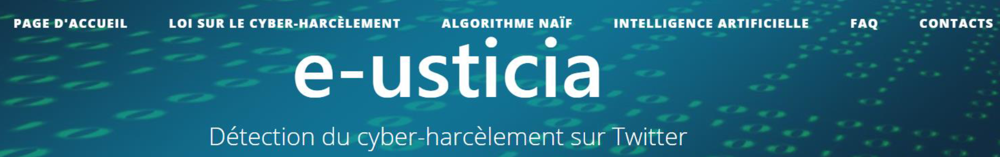

# Projet de détection du cyber-harcèlement sur Twitter (NLP)

Ce projet a été réalisé par quatre étudiants de l'Ecole des Mines de Saint-Etienne :
Lisa Giordani, Erwan Tinen-Touolac, Adrien Grimberg et Oscar Jozon, accompagnés par l'enseignant-chercheur de l'Institut Fayol, Maxime Lefrançois.

Ce fichier présente les différents fichiers et dossiers presents dans le dossier _Rendu_technique_.

- _Installation_Symfony_Windows_ : un fichier d'aide à l'installation et au lancement du projet Symfony sous Windows (conseillé)
- _Installation_Symfony_Linux_ : un fichier d'aide à l'installation et au lancement du projet Symfony sous Linux
- _Demonstration_site_web.mp4_ : dans le cas où vous n'arriveriez pas à lancer le serveur du projet Symbony, nous avons réalisé une vidéo de démonstration du site web

- _protech_ : le dossier du projet Symfony
- _db_protech.sql_ : les fichiers correspondants aux tables de la base de données MySQL utilisée dans le projet Symfony
- _Intelligence_artificielle_ : le dossier rassemblant les fichiers utilisés afin d'entrainer et de tester l'intelligence artificielle

- _Rapport_technique_ : le rapport technique du projet technique
- _Documentation_ : la documentation du code du projet Symfony
- _presentation_protech_ : le diaporama utilisé lors de la soutenance du projet technique
